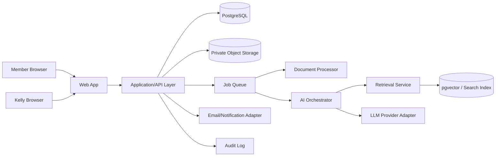

> Kelly Online docs — [README](../README.md) · [MVP](MVP.md) · [PRD](PRD.md) · **SDD** · [Backlog](BACKLOG.md) · [Agile](AGILE.md) · [AI Safety & Data](AI-SAFETY-DATA.md) · [Kelly Ops](KELLY-OPS.md) · [Launch Checklist](LAUNCH-CHECKLIST.md) · [Agent Rules](AGENTS.md)

# Software Design Document

## 1. Architecture goals

The architecture serves the release scope in [MVP.md](MVP.md) and the safety requirements in [AI-SAFETY-DATA.md](AI-SAFETY-DATA.md).

The MVP architecture optimises for:

- fast iteration;
- strong data boundaries;
- auditability;
- source-grounded AI;
- low operational overhead;
- eventual multi-tenant SaaS migration.

Avoid premature microservices.

Use a modular monolith first.

## 2. High-level architecture



## 3. Modular monolith modules

### Identity

- User.
- Session.
- Role.
- Permission.
- Account recovery.

### Membership

- MemberProfile.
- MembershipPlan.
- Entitlement.
- Subscription.

### Casework

- Case.
- CaseParticipant.
- CaseStatus.
- CaseMessage.
- CaseNote.
- CaseAction.
- CaseTimelineEvent.
- Escalation.

### Documents

- Document.
- DocumentVersion.
- ExtractedText.
- DocumentChunk.
- DocumentLink.

### Knowledge

- KnowledgeSource.
- KnowledgeSourceVersion.
- KnowledgeChunk.
- SourceCitation.
- SourceReview.

### AI

- AIInteraction.
- AIJob.
- AIPromptVersion.
- AIOutput.
- AIEvaluation.
- ModelProvider.
- RetrievalTrace.

### Advisor

- AdvisorQueue.
- Review.
- Approval.
- PrivateNote.

### Notifications

- Notification.
- NotificationPreference.
- DeliveryAttempt.

### Audit

- AuditEvent.
- SecurityEvent.

## 4. Domain model

Simplified:

```text
User
 ├── MemberProfile
 └── AdvisorProfile

MemberProfile
 └── Case*

Case
 ├── CaseMessage*
 ├── CaseDocument*
 ├── CaseTimelineEvent*
 ├── CaseAction*
 ├── Escalation*
 ├── AIInteraction*
 └── AdvisorReview*

Document
 ├── OriginalObject
 ├── ExtractedText
 └── Chunks*

KnowledgeSource
 └── KnowledgeSourceVersion*
      └── KnowledgeChunk*
```

## 5. Tenant readiness

Even with one organisation at launch, include `organisation_id` on domain records where future SaaS isolation will require it.

Do not expose tenant IDs from the browser as authority.

Server-side authorisation must check:

`authenticated user -> organisation -> role -> resource ownership/permission`.

## 6. Recommended database entities

### users

- id
- email
- status
- created_at
- last_login_at

### organisations

- id
- name
- status

### organisation_users

- organisation_id
- user_id
- role

### member_profiles

- id
- user_id
- display_name
- employer_name
- staff_group
- created_at

Minimise fields. Do not collect information merely because it may be useful one day.

### cases

- id
- organisation_id
- member_id
- title
- type
- status
- urgency
- desired_outcome
- next_important_at
- created_at
- updated_at
- closed_at

### case_messages

- id
- case_id
- author_user_id
- visibility
- content
- created_at

Visibility values must differentiate:

- member-visible;
- advisor-private;
- system.

### documents

- id
- organisation_id
- owner_user_id
- storage_key
- original_filename
- media_type
- sha256
- status
- created_at

### case_documents

- case_id
- document_id
- category

### knowledge_sources

- id
- organisation_id nullable for global source
- title
- publisher
- source_type
- jurisdiction
- canonical_url

### knowledge_source_versions

- id
- source_id
- version_label
- effective_from
- effective_to
- fetched_at
- checksum
- review_status
- supersedes_id

### citations

- id
- ai_output_id
- knowledge_chunk_id
- claim_key

### escalation_events

- id
- case_id
- rule_id
- reason
- severity
- detected_by
- created_at
- resolved_at
- resolved_by

## 7. API style

JSON HTTP API or Next.js server actions are both acceptable.

Critical rule: business permissions live server-side and are independently testable.

Suggested endpoints/domain actions:

```text
POST   /cases
GET    /cases/:id
POST   /cases/:id/messages
POST   /cases/:id/documents
POST   /cases/:id/request-review
PATCH  /cases/:id/status

GET    /advisor/queue
POST   /advisor/cases/:id/reply
POST   /advisor/cases/:id/private-notes
POST   /advisor/cases/:id/escalations/:id/resolve

POST   /ai/cases/:id/intake
POST   /ai/cases/:id/reanalyse
GET    /ai/jobs/:id

GET    /knowledge/sources/:id
POST   /knowledge/sources
POST   /knowledge/sources/:id/versions
```

## 8. Document pipeline

1. User requests upload.
2. Server authorises ownership.
3. Upload to quarantine/private object storage.
4. Validate real file type.
5. Malware scan if available.
6. Generate checksum.
7. Extract text.
8. Store extraction metadata.
9. Chunk document.
10. Create embeddings where permitted.
11. Attach chunks to case-only retrieval namespace.
12. Mark ready.

Important:

Member documents must never accidentally become global knowledge sources.

## 9. RAG architecture

Retrieval namespaces:

### Global authoritative

National sources approved by platform.

### Organisation

Trust/organisation policies.

### Case

Member's private documents/messages.

Retrieval order is query-dependent, but output must label source class.

AI input should include only the minimum retrieved material required.

## 10. AI orchestration

Use task-specific prompts instead of one enormous system prompt.

Suggested tasks:

- `case_classify`
- `extract_events`
- `extract_deadlines`
- `ask_missing_questions`
- `retrieve_queries`
- `member_explain`
- `advisor_brief`
- `draft_response`
- `safety_classify`

Each output should be structured JSON validated against a schema before use.

Model output is data, not authority.

## 11. Deadline safety

Never allow the model to be the only deadline calculator (policy: [AI-SAFETY-DATA.md](AI-SAFETY-DATA.md), "Deadline policy").

Architecture:

1. AI extracts candidate date and event type.
2. Deterministic rules calculate possible warning dates where rules are sufficiently defined.
3. UI labels results as `potential deadline — verify`.
4. High-risk date creates escalation.
5. Kelly can confirm/correct.
6. Correction is retained in audit history.

## 12. Prompt/version tracking

Every AI output stores:

- provider;
- model identifier;
- prompt version;
- retrieval trace IDs;
- timestamp;
- structured result;
- validation result;
- user/advisor corrections.

This makes regressions and incident investigation possible.

## 13. Security

### Required

- TLS.
- encrypted database/storage at rest.
- secrets manager/environment isolation.
- least-privilege DB/storage credentials.
- signed short-lived file URLs.
- CSRF protection where relevant.
- rate limiting.
- secure cookie settings.
- MFA for Kelly/admin strongly recommended.
- audit logs.
- dependency scanning.
- backups.
- restore test.

### Logging

Application logs must avoid:

- case narrative;
- document contents;
- health details;
- allegations;
- authentication secrets.

Use IDs and error codes.

## 14. Deletion/retention

Create explicit policies for:

- inactive accounts;
- closed cases;
- uploaded originals;
- extracted/embedded derivatives;
- backups;
- audit events.

Deleting a source object must also address derived extracted text/embeddings where legally and technically appropriate.

## 15. Observability

Track:

- request errors;
- auth failures;
- queue failures;
- document extraction failures;
- LLM provider errors;
- citation validation failures;
- escalation counts;
- notification delivery failures.

Never use sensitive case text as telemetry.

## 16. Deployment

Environments:

- local;
- test;
- staging;
- production.

Production access should be minimal.

Database migrations run through CI/release process.

Feature flags should protect:

- AI tasks;
- new case categories;
- billing;
- automated notifications.

## 17. Backup objective

For pilot:

- automated daily database backups minimum;
- object storage versioning/backups;
- documented restore procedure;
- restore tested before public beta.

## 18. Future extraction points

Split services only when justified:

- document processing;
- AI jobs;
- notifications;
- billing;
- multi-tenant knowledge ingestion.

Do not split merely to appear "enterprise."
